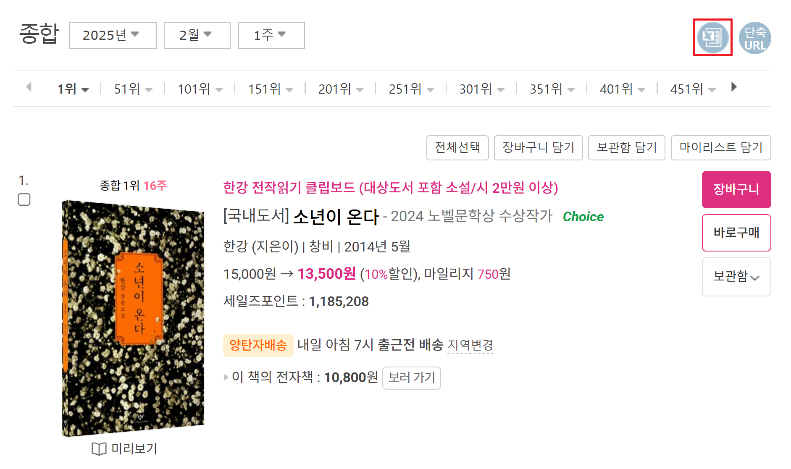
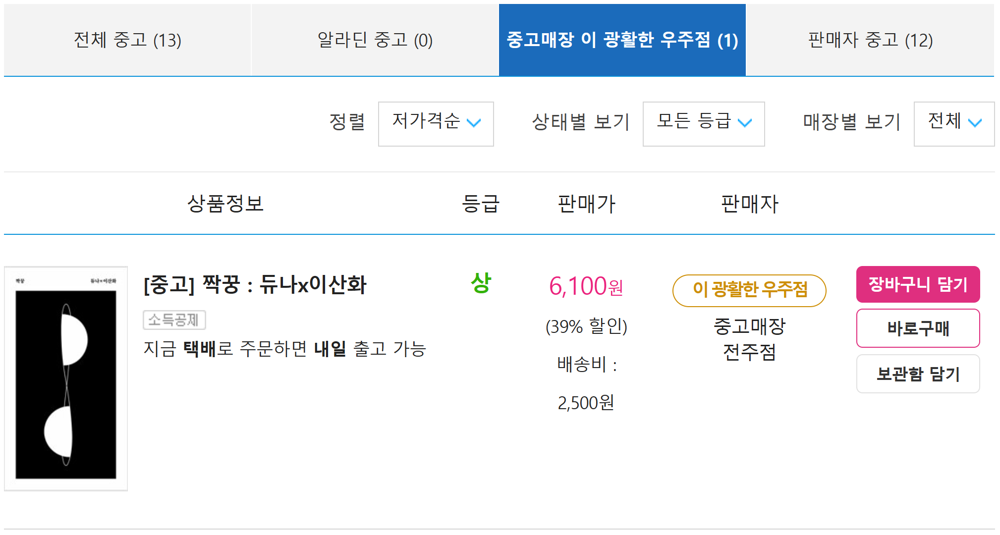

**KOR** · [ENG](./README_EN.md)

# 알라딘 베스트 셀러 및 중고 도서 데이터셋 구축

**프로젝트 구성원**: 오도은, 박예림, 이준성, 정홍섭

**사용된 스킬 셋**: NumPy, Pandas, Matplotlib, Beautifulsoup, re, Scikit-learn

## 0. 초록

- 알라딘 00년 1월 1주차 ~ 24년 7월 2주차의 베스트셀러 목록을 크롤링하여 141.5만 행의 Dataset 구축
  - 15.8만여 종의 도서에 대하여, 해당 주차에서의 순위 및 도서 관련 정보를 포함
- 주간 베스트 셀러 DB를 바탕으로, 78만 행의 알라딘 중고 매장의 중고 도서 Dataset 구축
  - 10.3만여 종의 역대 베스트셀러 도서에 대한 중고 도서 매물 데이터

## 1. 디렉토리 구조

```
aladin_book_dataset
├── code : 크롤링/데이터 전처리 등에 쓰인 python 코드
├── dataset
│   ├── bookinfo
│   │   ├── bestseller_240718.csv : 알라딘 주간 베스트셀러 Dataset
│   │   └── bestseller_cleaned_240718.csv : 위 Dataset에 포함된 도서의 목록
│   └── usedinfo
│       └── usedproduct_240718.csv : 알라딘 중고 도서 Dataset
├── rawdata
│   ├── bookinfo : 수집한 베스트셀러 목록(csv)
│   └── usedinfo : 크롤링하여 얻은 중고도서 목록(csv) 등
└── research : 크롤링 코드 개발 등에 쓰인 ipynb 파일
```

## 2. 데이터셋

### 1. 알라딘 주간 베스트셀러 Dataset

#### 개요

- 총 1,415,586개의 row에 15개의 column
  - 각 주차 별 베스트셀러 순위 및 상품 관련 정보
  - 160,681 종의 상품 중 국내도서는 158,084 종
- [알라딘의 주간 베스트셀러 페이지](https://www.aladin.co.kr/shop/common/wbest.aspx?BranchType=1)에서 제공한 1~1000위에 대한 xls 파일 데이터를 [수집](./research/240718_crawling_step0-2_by_js.ipynb)하여 구성
  - 2000년 1월 1주차 ~ 2024년 7월 2주차까지의 데이터를 포괄하며, 24-07-10 ~ 24-07-12 동안 수집 진행

  

  *<b>도표.1</b> 알라딘 주간 베스트셀러 페이지 예시*

  |    |Columns          |Description                                   |
  |---:|:---------------:|----------------------------------------------|
  | 0  | Rank            |주간 베스트셀러에 올랐을 때, 해당 상품의 당시 순위|
  | 1  | Division        |국내도서, 외국도서 등으로 구분|
  | 2  | BookName        |상품 이름|
  | 3  | ItemId          |알라딘에서 부여한 해당 상품의 고유 id. 도서 외에 당시 베스트 셀러가 됐던 MD 굿즈, 강연 등도 소수 포함. |
  | 4  | ISBN13          |전세계에서 공통적으로 사용하는 도서에 대한 id. 발행자 등의 정보가 포함.|
  | 5  | Code            |부가기호. 5개의 숫자로 됨. 한국 문헌 보호 센터에서 부여하는 번호로, 예상 독자층에 대한 정보 등이 포함.|
  | 6  | Authors         |저자|
  | 7  | Publisher       |출판사|
  | 8  | PublishDate     |출간일|
  | 9  | RegularPrice    |정가|
  | 10 | SalesPrice      |판매가|
  | 11 | Mileage         |마일리지|
  | 12 | SalesPoint      |판매량과 판매기간에 근거하여 해당 상품의 판매도를 산출한 알라딘만의 (크롤링 시점에서의) 판매지수|
  | 13 | Category        |도서가 속한 장르|
  | 14 | BestsellerWeek  |해당 상품이 베스트셀러에 올랐었던 주 차|

  *<b>도표.2</b> 알라딘 주간 베스트 셀러 Dataset의 columns*

#### Quick Peek

```bash
$ head ./dataset/bookinfo/bestseller_240718.csv 
Rank,Division,BookName,ItemId,ISBN13,Code,Authors,Publisher,PublishDate,RegularPrice,SalesPrice,Mileage,SalesPoint,Category,BestsellerWeek
1,국내도서,세상의 바보들에게 웃으면서 화내는 방법,208008,9788932902562,03860,"움베르토 에코 지음, 이세욱 옮김",열린책들,19991010,"9,500","8,550",470점,2695,에세이,2000년1월1주
2,국내도서,오두막 편지,215589,9788985599214,,법정 지음,이레,19991215,"7,000","6,300",350점,1922,종교/역학,2000년1월1주
3,국내도서,잠자는 아이디어 깨우기,212072,9788973372843,03840,"잭 포스터 지음, 정상수 옮김",해냄,19991120,"8,000","7,200",400점,267,자기계발,2000년1월1주
4,국내도서,해리 포터와 마법사의 돌 1 (무선),210689,9788983920683,04840,"조앤 K. 롤링 지음, 김혜원 옮김",문학수첩,19991119,"8,000","7,200",400점,20442,소설/시/희곡,2000년1월1주
5,국내도서,해리 포터와 비밀의 방 1 (무선),216131,9788983920706,04840,"조앤 K. 롤링 지음, 김혜원 옮김",문학수첩,19991220,"8,000","7,200",400점,16978,소설/시/희곡,2000년1월1주
6,국내도서,해리 포터와 비밀의 방 2 (무선),216133,9788983920713,04840,"조앤 K. 롤링 지음, 김혜원 옮김",문학수첩,19991230,"8,000","7,200",400점,16601,소설/시/희곡,2000년1월1주
7,국내도서,해리 포터와 마법사의 돌 2 (무선),210691,9788983920690,04840,"조앤 K. 롤링 지음, 김혜원 옮김",문학수첩,19991119,"8,000","7,200",400점,18465,소설/시/희곡,2000년1월1주
8,국내도서,풍경,203884,9788985599221,03810,원성 글.그림,이레,19990830,"8,000","7,200",400점,1907,종교/역학,2000년1월1주
9,국내도서,아웃사이더를 위하여,215347,9788985304511,,김규항 김정란 진중권 홍세화 지음,아웃사이더,19991125,"7,000","6,300",350점,807,사회과학,2000년1월1주
```

### 2. 알라딘 중고 도서 Dataset

#### 개요

- 총 784,213개의 row, 7개의 column으로 구성.
  - 103,055 종의 도서에 대한 중고도서 매물 784,213건
- [알라딘 온라인 중고매장(광활한 우주점)](https://www.aladin.co.kr/usedstore/wonline.aspx?start=we)에 등록 된 중고 도서 매물 데이터
- 위의 베스트셀러 Dataset에 포함된 도서(ItemId)를 기준으로 각 도서별 중고 매물 목록 페이지에서 [크롤링](./code/step1_crawling_usedinfo.py)한 중고도서 매물 Dataset
  - 기준이 된 목록 : `/dataset/bookinfo/bestseller_cleaned_240718.csv`

  
  
  *<b>도표.3</b> [도서 별 중고 매물 목록 페이지 예시](https://www.aladin.co.kr/shop/UsedShop/wuseditemall.aspx?ItemId=254468327&TabType=3&Fix=1
  )*


  |  |Columns      |Description|
  |-:|:-----------:|-|
  |0 | ItemId      | 해당 중고 매물의 (새 책 기준) ItemId. |
  |1 | UsedIdx     | 해당 중고 매물이 해당 도서의 중고도서 목록 페이지에 있었던 순서. |
  |2 | DeliveryFee | 배송비. |
  |3 | Price       | 해당 중고 매물 판매가. |
  |4 | Quality     | 중고 등급. '균일가' 및 '하', '중', '상', '최상'으로 구분. |
  |5 | Store       | 해당 중고 매물의 취급 지점 |
  |6 | Url         | 해당 중고 매물의 판매 페이지 url. |

  *<b>도표.4</b> 알라딘 중고 도서 Dataset의 columns*

#### Quick Peek

```bash
$ head ./dataset/usedinfo/usedproduct_240718.csv 
ItemId,UsedIdx,DeliveryFee,Price,Quality,Store,Url
1000071,1,2500,1200,균일가,중고매장부산덕천점,https://www.aladin.co.kr/shop/wproduct.aspx?ItemId=140023651
1000071,2,2500,1500,중,중고매장대전시청역점,https://www.aladin.co.kr/shop/wproduct.aspx?ItemId=109459918
1000071,3,2500,1500,균일가,중고매장부산 경성대.부경대역점,https://www.aladin.co.kr/shop/wproduct.aspx?ItemId=198392913
1000071,4,2500,1500,균일가,중고매장광주충장로점,https://www.aladin.co.kr/shop/wproduct.aspx?ItemId=189185916
1000071,5,2500,1500,균일가,중고매장대전시청역점,https://www.aladin.co.kr/shop/wproduct.aspx?ItemId=189184440
1000071,6,2500,1500,균일가,중고매장전주점,https://www.aladin.co.kr/shop/wproduct.aspx?ItemId=170067222
1000071,7,2500,6100,중,중고매장마산합성점,https://www.aladin.co.kr/shop/wproduct.aspx?ItemId=328649150
1001409,1,2500,4600,중,중고매장전주점,https://www.aladin.co.kr/shop/wproduct.aspx?ItemId=331232822
1001409,2,2500,4700,중,중고매장일산점,https://www.aladin.co.kr/shop/wproduct.aspx?ItemId=342294915
```

## 참고

- [OLPJ24][(OLPJ24)] : Doeun Oh, Junseong Lee, Yerim Park, and Hongseop Jeong, 알라딘 중고 도서 데이터셋 구축 및 그에 기반한 중고 서적 가격 예측 모델, GitHub, 2024

[(OLPJ24)]:https://github.com/kdt-3-second-Project/aladin_usedbook "OLPJ24"
