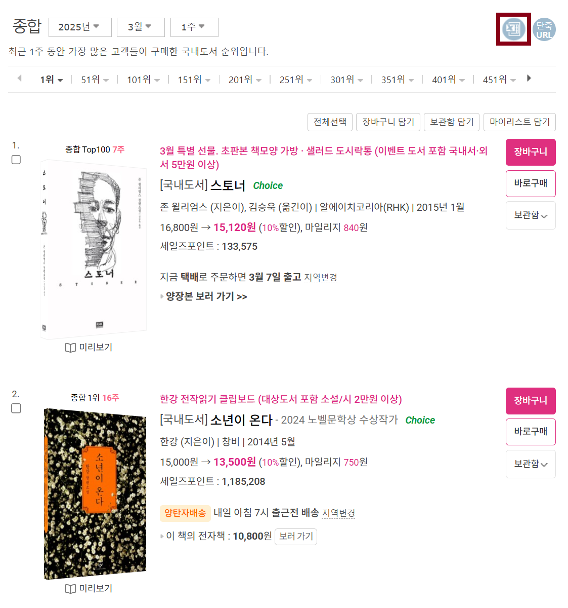
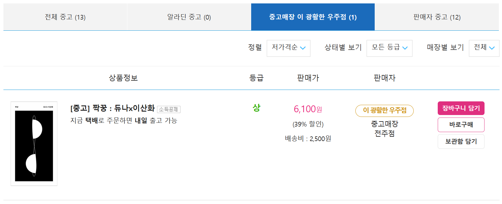

[KOR](./README.md) · **ENG**

# Aladin Weekly Bestseller Dataset and Used-bookstore Dataset

Authors : Doeun Oh, Junseong Lee, Yerim Park, and Hongseop Jeong

**Libraries**: NumPy, Pandas, Matplotlib, Beautifulsoup, re, Scikit-learn

## 0. Abstract

- Built the Aladin Weekly Bestseller Dataset, which has 1.42 million rows and covers from 1st week of Jan. 2000 to 2nd week of Jul. 2024.
  - There is information about books, including a ranking at the week, for 0.16 million titles.
- Based on the Aladin Weekly Bestseller Dataset, we built the Aladin Used-bookstore Dataset, which consists of 0.78 million rows for 0.1 million titles.

## 1. The Structure of Directories

```
aladin_book_dataset
├── code : Python codes used in crawling,preprocess, etc.
├── dataset
│   ├── bookinfo
│   │   ├── bestseller_240718.csv : Aladin Weekly Bestseller Dataset
│   │   └── bestseller_cleaned_240718.csv : A list of books included in the Aladin Weekly Bestseller Dataset
│   └── usedinfo
│       └── usedproduct_240718.csv : Aladin Used-bookstore Dataset
├── rawdata
│   ├── bookinfo : collected weekly bestseller files(csv)
│   └── usedinfo : crawled used-bookstore data files(csv), etc.
└── research : .ipynb files used in developing codes, etc.
```

## 2. Datasets

### 1. Aladin Weekly Bestseller Dataset

#### Informations

- 1,415,586 rows and 15 columns
  - rankings and informations of merchandise in Aladin weekly bestseller lists.
  - In 160,681 types of merchandises, there is 158,084 types of domestic-books.
- At [Aladin weekly bestseller pages](https://www.aladin.co.kr/shop/common/wbest.aspx?BranchType=1), they provide `.xls` files of bestseller informations.
- We had [collected](./research/240718_crawling_step0-2_by_js.ipynb) files to bulid the dataset from 24-07-10 to 24-07-12.
- It covers data from 1st week of Jan. 2000 to 2nd week of Jul. 2024.

  

  *<b>Fig.1</b> An example of Aladin weekly bestseller pages*

  |    |Columns          |Description                                   |
  |---:|:---------------:|----------------------------------------------|
  | 0  | Rank            |A ranking of an merchandise, when an merchandise was included in an weekly bestseller list.|
  | 1  | Division        |Domestic books, Foreign books, etc.|
  | 2  | BookName        |A name of an merchandise.|
  | 3  | ItemId          |An ID of an merchandise assigned from Aladin.|
  | 4  | ISBN13          |The International Standard Book Number consisted of 13 digits.|
  | 5  | Code            |a 5 digit code assigned by the ISBN·ISSN·deposit system in the National Library of Korea.|
  | 6  | Authors         |-|
  | 7  | Publisher       |-|
  | 8  | PublishDate     |A date when a merchandise is published|
  | 9  | RegularPrice    |-|
  | 10 | SalesPrice      |-|
  | 11 | Mileage         |-|
  | 12 | SalesPoint      |Aladin's sales index that calculates the sales of the merchandise based on sales volume and sales period, at the time of crawling.|
  | 13 | Category        |A genre that a merchandise coresspond to.|
  | 14 | BestsellerWeek  |A week when an merchandise was included in an weekly bestseller list.|

  *<b>Table.1</b> Columns of the Aladin weekly bestseller dataset*

#### Quick Peek

```bash
$ head ./dataset/bookinfo/bestseller_240718.csv 
Rank,Division,BookName,ItemId,ISBN13,Code,Authors,Publisher,PublishDate,RegularPrice,SalesPrice,Mileage,SalesPoint,Category,BestsellerWeek
1,국내도서,세상의 바보들에게 웃으면서 화내는 방법,208008,9788932902562,03860,"움베르토 에코 지음, 이세욱 옮김",열린책들,19991010,"9,500","8,550",470점,2695,에세이,2000년1월1주
2,국내도서,오두막 편지,215589,9788985599214,,법정 지음,이레,19991215,"7,000","6,300",350점,1922,종교/역학,2000년1월1주
3,국내도서,잠자는 아이디어 깨우기,212072,9788973372843,03840,"잭 포스터 지음, 정상수 옮김",해냄,19991120,"8,000","7,200",400점,267,자기계발,2000년1월1주
4,국내도서,해리 포터와 마법사의 돌 1 (무선),210689,9788983920683,04840,"조앤 K. 롤링 지음, 김혜원 옮김",문학수첩,19991119,"8,000","7,200",400점,20442,소설/시/희곡,2000년1월1주
5,국내도서,해리 포터와 비밀의 방 1 (무선),216131,9788983920706,04840,"조앤 K. 롤링 지음, 김혜원 옮김",문학수첩,19991220,"8,000","7,200",400점,16978,소설/시/희곡,2000년1월1주
6,국내도서,해리 포터와 비밀의 방 2 (무선),216133,9788983920713,04840,"조앤 K. 롤링 지음, 김혜원 옮김",문학수첩,19991230,"8,000","7,200",400점,16601,소설/시/희곡,2000년1월1주
7,국내도서,해리 포터와 마법사의 돌 2 (무선),210691,9788983920690,04840,"조앤 K. 롤링 지음, 김혜원 옮김",문학수첩,19991119,"8,000","7,200",400점,18465,소설/시/희곡,2000년1월1주
8,국내도서,풍경,203884,9788985599221,03810,원성 글.그림,이레,19990830,"8,000","7,200",400점,1907,종교/역학,2000년1월1주
9,국내도서,아웃사이더를 위하여,215347,9788985304511,,김규항 김정란 진중권 홍세화 지음,아웃사이더,19991125,"7,000","6,300",350점,807,사회과학,2000년1월1주
```

### 2. Aladin Used-bookstore Dataset

#### Informations

- 784,213 rows and 7 columns.
  - 784,213 used-books for 103,055 titles.
- The dataset of usedbooks sales on the [Aladin Online Used-bookstore(광활한 우주점)](https://www.aladin.co.kr/usedstore/wonline.aspx?start=we)
  - [Crawled](./code/step1_crawling_usedinfo.py) based on the list; `/dataset/bookinfo/bestseller_cleaned_240718.csv`; processed from the Aladin Weekly Bestseller dataset.

  
  
  *<b>Fig.2</b> [An Example of used product pages for each book.](https://www.aladin.co.kr/shop/UsedShop/wuseditemall.aspx?ItemId=254468327&TabType=3&Fix=1
  )*

  |  |Columns      |Description|
  |-:|:-----------:|-|
  |0 | ItemId      | The ItemId of the new book correspond to an used-book. |
  |1 | UsedIdx     | An order where an used-book were listed on the used product page for that book.|
  |2 | DeliveryFee | - |
  |3 | Price       | Price of an used-book |
  |4 | Quality     | '균일가'(uniform price), '하'(lower), '중'(middle), '상'(upper) or '최상'(best) |
  |5 | Store       | a store where an used-book is in.|
  |6 | Url         | a sales URL for an used-book. |

  *<b>Table.2</b> Columns of the Aladin used-bookstore dataset*

#### Quick Peek

```bash
$ head ./dataset/usedinfo/usedproduct_240718.csv 
ItemId,UsedIdx,DeliveryFee,Price,Quality,Store,Url
1000071,1,2500,1200,균일가,중고매장부산덕천점,https://www.aladin.co.kr/shop/wproduct.aspx?ItemId=140023651
1000071,2,2500,1500,중,중고매장대전시청역점,https://www.aladin.co.kr/shop/wproduct.aspx?ItemId=109459918
1000071,3,2500,1500,균일가,중고매장부산 경성대.부경대역점,https://www.aladin.co.kr/shop/wproduct.aspx?ItemId=198392913
1000071,4,2500,1500,균일가,중고매장광주충장로점,https://www.aladin.co.kr/shop/wproduct.aspx?ItemId=189185916
1000071,5,2500,1500,균일가,중고매장대전시청역점,https://www.aladin.co.kr/shop/wproduct.aspx?ItemId=189184440
1000071,6,2500,1500,균일가,중고매장전주점,https://www.aladin.co.kr/shop/wproduct.aspx?ItemId=170067222
1000071,7,2500,6100,중,중고매장마산합성점,https://www.aladin.co.kr/shop/wproduct.aspx?ItemId=328649150
1001409,1,2500,4600,중,중고매장전주점,https://www.aladin.co.kr/shop/wproduct.aspx?ItemId=331232822
1001409,2,2500,4700,중,중고매장일산점,https://www.aladin.co.kr/shop/wproduct.aspx?ItemId=342294915
```

## Reference

- [OLPJ24][(OLPJ24)] : Doeun Oh, Junseong Lee, Yerim Park, and Hongseop Jeong, 알라딘 중고 도서 데이터셋 구축 및 그에 기반한 중고 서적 가격 예측 모델, GitHub, 2024

## License

- MIT
- cf. [Instructions for using Aladin OpenAPIs](https://blog.aladin.co.kr/openapi/5353304)

[(OLPJ24)]:https://github.com/kdt-3-second-Project/aladin_usedbook "OLPJ24"
